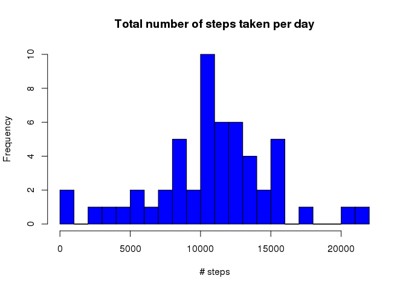
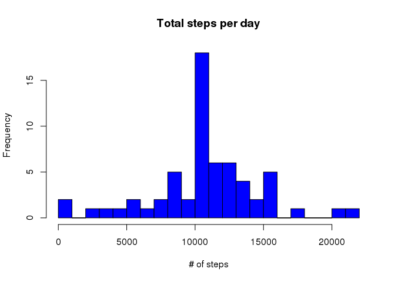
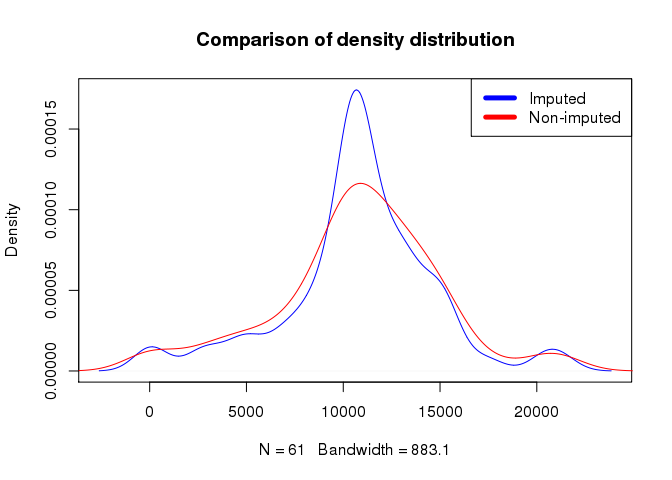
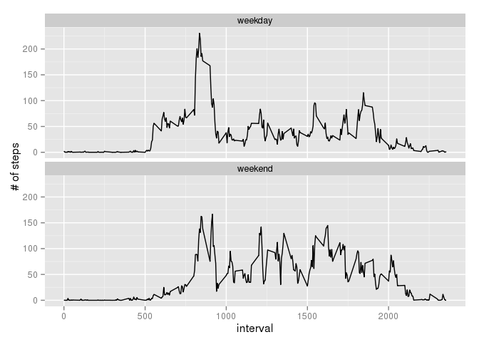
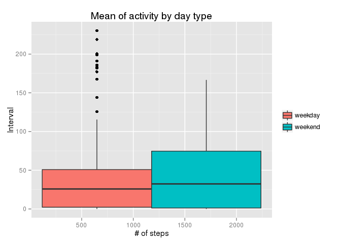

# Reproducible Research: Peer Assessment 1

## Introduction
  This report is part of the Coursera **Reproducible Research** class.

I am going to use the data from a personal activity monitoring device to answer a series of question.
This device collects data at 5 minute intervals through out the day. The data consists of two months of data from an anonymous individual collected during the months of October and November, 2012 and include the number of steps taken in 5 minute intervals each day.

## Loading and preprocessing the data


```r
suppressPackageStartupMessages(library(dplyr))
file<-"activity.zip"
temp<-unzip(file)
data<-read.csv(temp)
data$date <- as.Date(data$date)
data<-tbl_df(data)
```

## What is mean total number of steps taken per day?

```r
stepsByDay <- aggregate(steps ~ date, data, sum)
hist(stepsByDay$steps, main = paste("Total number of steps taken per day"), col="blue", xlab="# steps",breaks=30)
```

 

```r
meanSteps<-as.integer(round(mean(stepsByDay$steps),2))
medianSteps<-median(stepsByDay$steps)
```

The mean of the total number of steps by day is 10766 and the median 10765.
The data appears to be normal.


## What is the average daily activity pattern?

    Make a time series plot (i.e. type = "l") of the 5-minute interval (x-axis) and the average number of steps taken, averaged across all days (y-axis)


```r
stepsByInterval <- aggregate(steps ~ interval, data, mean)

plot(stepsByInterval$interval,stepsByInterval$steps, type="l", xlab="Interval", ylab="# of steps",main="Average # of steps by interval")
```

 


    Which 5-minute interval, on average across all the days in the dataset, contains the maximum number of steps?
    

```r
maxStepsByInterval <- stepsByInterval[which(stepsByInterval$steps==max(stepsByInterval$steps)),1]
```

The maximum number of steps is on the 5 minute interval: 835

## Imputing missing values


```r
missing<-sum(is.na(data$steps))
```
There are 2304 missing values.

I will now impute the missing values by replacing them with the 5 minute mean of that interval.

```r
imputedData<-data
imputedData$steps<-ifelse(is.na(data$steps),stepsByInterval$steps, data$steps)
```

Next I will recheck the histogram and means to see what importance do the missing values have.


```r
imputedStepsByDay <- aggregate(steps ~ date, imputedData, sum)
hist(imputedStepsByDay$steps, main = paste("Total steps per day"), col="blue", xlab="# of steps",breaks=30)
```

 

```r
plot(density(imputedStepsByDay$steps),col="blue",main="Comparison of density distribution")
lines(density(stepsByDay$steps),col="red")
legend("topright", c("Imputed", "Non-imputed"), col=c("blue", "red"),lwd=5)
```

 

```r
meanImputedSteps<-as.integer(round(mean(imputedStepsByDay$steps),2))
medianImputedSteps<-as.integer(median(imputedStepsByDay$steps))
```


The mean of the total number of steps by day is 10766 and the median 10766.

Do these values differ from the estimates from the first part of the assignment? 

The data is normal and it appears there is no big difference between the normal data means and the imputed data means.

What is the impact of imputing missing data on the estimates of the total daily number of steps?

The missing values were inserted in days without activity thus increasing the most important intervals frequency, it follows the central limit theorem, the more observations the more values in the mean.

## Are there differences in activity patterns between weekdays and weekends?


```r
suppressPackageStartupMessages(library(ggplot2))
imputedData$day<-ifelse(!(weekdays(imputedData$date) %in% c('Saturday','Sunday')),"weekday","weekend")
imputedData$day<-as.factor(imputedData$day)


imputedStepsByInterval<- aggregate(steps ~ interval + day, imputedData, mean)

p <- ggplot(imputedStepsByInterval , aes(x=interval, y=steps)) + geom_line() + ylab("# of steps")
p + facet_wrap(~ day, ncol=1)
```

 

```r
weekMean<-round(mean(imputedStepsByInterval[imputedStepsByInterval$day=="weekday",]$steps),2)
weekendMean<-round(mean(imputedStepsByInterval[imputedStepsByInterval$day=="weekend",]$steps),2)
```


The mean of weekend activity 42.37 is higher then the mean of weekday activity 35.61.


```r
g1 <- ggplot(imputedStepsByInterval, aes(x=interval, y=steps, guides(fill=guide_legend(title=NULL)),fill=factor(day)))
g1 + geom_boxplot()  + 
    xlab("# of steps") + 
    ylab("Interval") + 
    labs(title="Mean of activity by day type")+ 
    theme(legend.title=element_blank())
```

 


